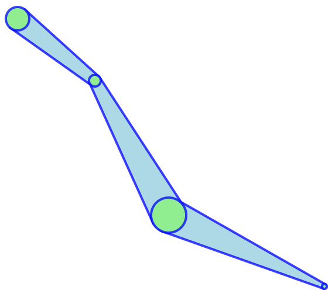
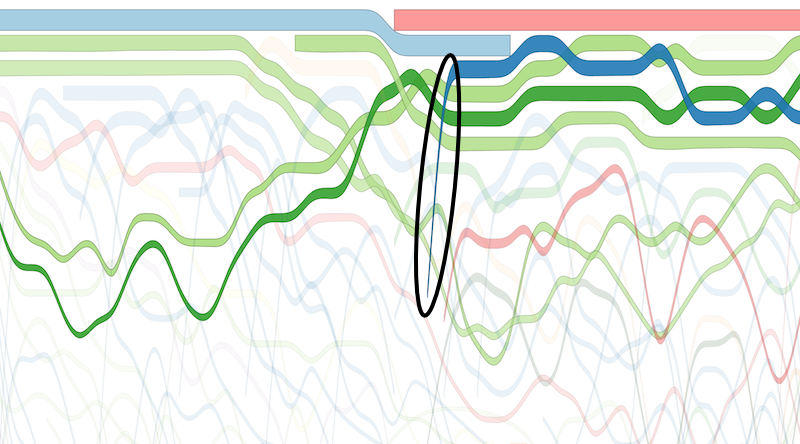
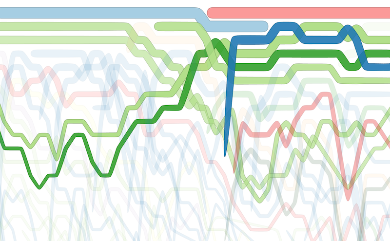

d3.svg.ribbon
===============

[Interactive example](http://bl.ocks.org/emeeks/a1e48992be56681e3f93)

Designed to interpolate ribbon or band areas based on sample points with radii.

`npm install d3-svg-ribbon`

**#ribbon.x()**

The x-accessor for the points array, just like d3.svg.line and d3.svg.area. Defaults to returning d.x.

**#ribbon.y()**

The y-accessor for the points array, just like d3.svg.line and d3.svg.area. Defaults to returning d.y.

**#ribbon.r()**

The radius accessor for the points array. This determines the thickness of the ribbon at that point. Defaults to returning d.r.

**#ribbon.interpolate()**

The D3 interpolation method to use. Currently has strange effects with all interpolators except `linear`, `linear-closed`, `basis` and `basis-closed`.

###Why?

I was dissatisfied with the way that thicknesses get attenuated creating bump charts with d3.svg.area. If they jump between ranks too significantly, it makes the corresponding graphical transition look too thin. Like the circled blue area, which is rendered significantly thinner than if it was being drawn horizontally.

In contrast, the same bump chart using d3.svg.ribbon does not create these attenuation artifacts.

